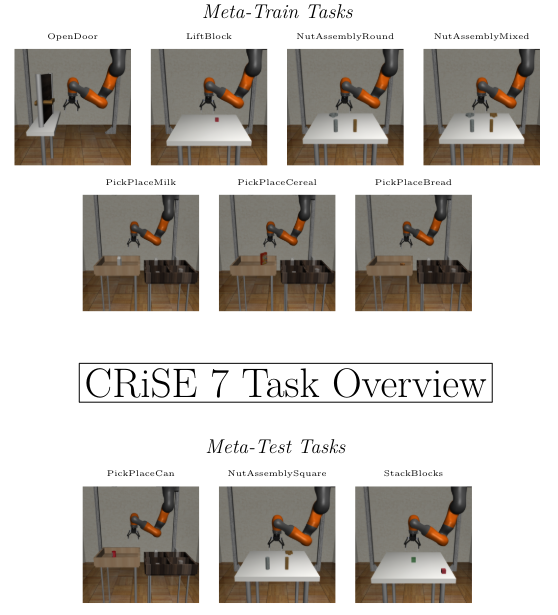
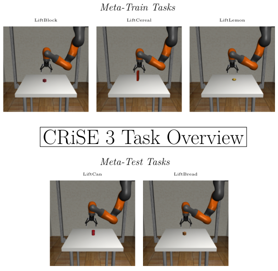

# CRiSE 1-3-7 — Compilations of Real-World inspired Robotic Task Simulation Environments

CRiSE 1-3-7 constitute three compilations of real-world inspired robotic task simulation environments that serve as simulation platforms to execute and test Meta-Reinforcement Learning (MRL) algorithms. All three compilations of simulation environments are inspired by the robotic setup at the TU Vienna Automation and Control Institute's Robotics Laboratory. 

**CRiSE 7** consists of seven meta-train tasks and three meta-test tasks, which all shall be solved successfully with a KUKA LBR IIWA14 robot. This robotic task compilation has the highest MRL complexity.

 

**CRiSE 3** utilises MRL algorithms in a different way. This environment is based on the _Lift_ task. Instead of learning how to handle just the block object like in CRiSE 1 and 7, CRiSE 3 shall focus on handling three different meta-train objects while fulfilling the _Lift_ task. Two meta-test objects shall show the adaptability of the algorithm to different, previously unseen object shapes.



**CRiSE 1** is a flexible task simulation environment where single tasks are natively set up in an MRL context. All in CRiSE 7 used tasks can also be defined as single-task problem environments here. This problem setting enables more robust learning of single tasks using MRL algorithms.

## Structure of the Repository

The general structure of the Repository is derived from [**Robosuite**](https://github.com/ARISE-Initiative/robosuite) (v1.3). All CRiSE 1-3-7 source code can be found in **robosuite/CRiSE137**.  

## Installation

**Step 1**

To make sure that the global Python development environment on your PC is not affected by the necessary CRiSE-specific Python Software setup, we recommend to use [Conda](https://conda.io/projects/conda/en/latest/user-guide/getting-started.html).    

**Step 2**

Create a new Conda environment with Python 3.8.16, [pip](https://pypi.org/project/pip/) and [git](https://www.git-scm.com/): 

```shell
conda create -n <your_env_name> python==3.8.16 pip git
```

**Step 3**

Before installing all necessary packages, run `sudo apt-get update` to refresh the package source list. The following command installs all packages: 

```shell
sudo apt-get install -y --no-install-recommends apt-utils build-essential \ 
libgl1-mesa-dev libgl1-mesa-glx libglew-dev libosmesa6-dev wget libglfw3 \
libglew-dev patchelf swig cmake zlib1g-dev libopenmpi-dev xvfb
```

**Step 4**

Install [MuJoCo 2.1.0](https://github.com/google-deepmind/mujoco/releases/tag/2.1.0/mujoco210-linux-x86_64.tar.gz) by running the following commands: 

```shell
mkdir ~/.mujoco
```

```shell
wget -q https://github.com/google-deepmind/mujoco/releases/download/2.1.0/mujoco210-linux-x86_64.tar.gz \
-O mujoco.tar.gz
```

```shell
tar -zxf mujoco.tar.gz -C ~/.mujoco
```

```shell
rm mujoco.tar.gz
```

**Step 5**

Add the following path to .bashrc:

```shell
export LD_LIBRARY_PATH=$LD_LIBRARY_PATH:~/.mujoco/mujoco210/bin
```

**Step 6**

Start the created Conda environment and install libstdcxx-ng:

```shell
conda activate <your_env_name>
```

```shell
conda install -c conda-forge libstdcxx-ng
```

**Step 7**

Clone **robosuite_CRiSE137** and the modified **garage** framework:

```shell
git clone https://github.com/jivancsics/robosuite_CRiSE137
```

```shell
git clone https://github.com/jivancsics/garage
```

**Step 8**

Go into the cloned **garage** directory and run:

```shell
pip install -e .
```

Install Meta-World:

```shell
pip install git+https://github.com/Farama-Foundation/Metaworld.git@master#egg=metaworld
```

After that, enter the cloned **robosuite_CRiSE137** directory and run:

```shell
pip install -e .
```

After executing all these steps, **CRiSE 1-3-7** is installed successfully in the Conda environment! 

Go to **robosuite/CRiSE137** for details on how to run the experiment launchers.


# Credits    
The idea behind CRiSE 1, CRiSE 3 and CRiSE 7 is derived from [**Meta-World**](https://github.com/Farama-Foundation/Metaworld), a meta- and multi-task reinforcement learning simulation benchmark.

The robotic simulation framework [**Robosuite**](https://github.com/ARISE-Initiative/robosuite) (v1.3) is utilised to design the different real-world inspired robotic task simulation environments. Also, the robot model of the specially configured _KUKA IIWA 14_ is integrated in Robosuite. 

The design of the TU Vienna Automation and Control Institute's Robotics Laboratory-inspired robot was created by **Florian Lechner**.      

All three compilations are integrated into the experiment structure of the Reinforcement Learning and Meta-Reinforcement Learning toolkit [**Garage**](https://github.com/rlworkgroup/garage). 

## License

[MIT](https://choosealicense.com/licenses/mit/)
